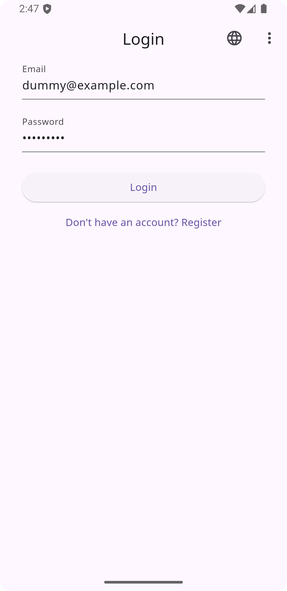
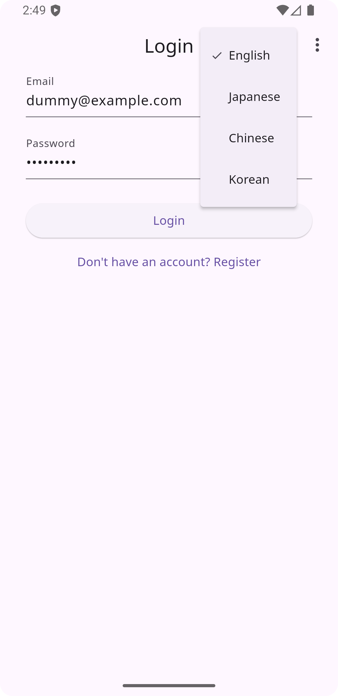

# 🔐 Firebase Login Template

Flutter + Firebase + Riverpod + Katana Localizationによる多言語対応ログインテンプレート  
Login template built with Flutter, Firebase, Riverpod, and Katana Localization.

---

## 📱 機能一覧 / Features
	•	✅ Firebase認証（メール/パスワード）
		✅ Firebase Authentication (Email/Password)
	•	✅ Riverpodによる状態管理
		✅ State management with Riverpod
	•	✅ Katana Localization（Googleスプレッドシート管理）
		✅ Katana Localization (managed via Google Sheets)
	•	✅ 多言語対応UI（英語・日本語・中国語・韓国語）
		✅ Multi-language UI (English, Japanese, Chinese, Korean)
	•	✅ 言語切替メニュー（アプリ右上から変更可能）
		✅ In-app language switcher (accessible from the top-right menu)

---

## 🧭 対応プラットフォーム | Supported Platforms

このテンプレートは以下の主要プラットフォームに対応しています：  
This template supports the following major platforms:

- ✅ **Android**
- ✅ **iOS**
- ✅ **Web**

> ⚠️ **注意 | Note**  
> Android および iOS および Web でFirebase Authenticationを使用するには、  
> **プロジェクト側で明示的な追加設定が必要です。設定を行わないと認証が機能しません。**
>
> ⚠️ To use Firebase Authentication on **Android** **iOS** or **Web**,  
> you **must configure additional settings** in your Firebase project.  
> Authentication will **not work** without proper setup.
---

## 🚀 セットアップ | Setup (with FVM)

このプロジェクトは [FVM (Flutter Version Management)](https://fvm.app) を使用しています。  
This project uses [FVM](https://fvm.app) to manage the Flutter SDK version.

### 🔧 インストール手順 / Installation steps

🔧 **事前準備 / Prerequisite**

このステップを実行する前に、Firebase コンソールで新しいプロジェクトを作成しておいてください。  
Before running this step, make sure to create a new project in the Firebase Console:  
👉 https://console.firebase.google.com/

```bash
git clone -b book-edition https://github.com/HajimeHotaka/login_template.git
cd login_template

# FVM をインストールして使えるようにする
# Install and activate FVM (Flutter Version Manager)
dart pub global activate fvm

# プロジェクトで指定された Flutter バージョンをインストール
# Install the Flutter version specified by this project
fvm install

# Node.js をインストール（Firebase CLI に必要）
# Install Node.js (required for Firebase CLI)
brew install node

# Firebase CLI をインストール
# Install Firebase CLI
npm install -g firebase-tools

# Firebase にログイン
# Log in to Firebase
firebase login

# FlutterFire CLI をインストール
# Install FlutterFire CLI
dart pub global activate flutterfire_cli

# Firebase 設定を生成（Android/iOS/Web 対応）
# Generate Firebase configuration for Android, iOS, and Web
flutterfire configure --platforms=android,ios,web

# 依存関係を取得
# Get Flutter dependencies
fvm flutter pub get

# コード生成（自動生成ファイルなど）
# Run code generation (e.g., for localization or routing)
fvm flutter pub run build_runner build --delete-conflicting-outputs

# アプリを起動
# Run the application
fvm flutter run
```

---

🍏 iOS 設定 / iOS Setup

Xcode でビルドするには、Apple Developer アカウントの Team ID と Bundle Identifier（アプリID）を設定する必要があります。  
To build with Xcode, you must set your Apple Developer Team ID and Bundle Identifier (App ID).

---

🔑 用語説明 / Terminology

- **Team ID**：Apple Developer アカウントに紐づいた識別子で、アプリの署名に必要。  
  **Team ID:** A unique identifier tied to your Apple Developer account, required for code signing.
- **Bundle Identifier**：アプリを一意に識別する ID。例：`jp.ne.sakura.falco.auth.sample`  
  **Bundle Identifier:** A unique app ID like `jp.ne.sakura.falco.auth.sample`.

---

🛠 設定手順 / Setup Steps

1. **Runner.xcodeproj** を Xcode で開く  
   _Open Runner.xcodeproj in Xcode_
2. **Signing & Capabilities** タブを開く  
   _Go to the Signing & Capabilities tab_
3. **Team** を自分の Apple Developer アカウントに設定  
   _Set the Team to your Apple Developer account_
4. **Bundle Identifier** を確認・必要に応じて変更  
   _Check and optionally change the Bundle Identifier_

---

❗ `.xcodeproj/project.pbxproj` から **DEVELOPMENT_TEAM** の設定は削除されています。再設定が必要です。  
❗ **The DEVELOPMENT_TEAM entry has been removed from `.xcodeproj/project.pbxproj`. You must reconfigure it.**


🤖 Android 設定 / Android Setup

Firebase Authentication を使うには、google-services.json を配置し、applicationId や namespace の設定が必要です。  
To use Firebase Authentication, you must place google-services.json and set the applicationId and namespace.

🔧 設定内容 / Required Settings

android/app/build.gradle
```
android {
    namespace "jp.ne.sakura.falco.auth.sample" // ← ← Change to your own ID
}
defaultConfig {
    applicationId "jp.ne.sakura.falco.auth.sample" // ← ← Change to your own ID
}
```

❗ namespace は Flutter 3.1+ で必須です。通常、applicationId と同じにします。  
❗ namespace is required in Flutter 3.1+. It’s usually the same as your applicationId.

---

🔐 Firebase設定ファイル / Firebase Config Files

このリポジトリには以下の機密ファイルは含まれていません。
These sensitive files are not included in this repository:
- android/app/google-services.json
- ios/Runner/GoogleService-Info.plist

各自の Firebase プロジェクトからダウンロードして所定の場所に配置してください。
Please download them from your own Firebase project and place them in the appropriate directories.

 ❗️注意 / Note: これらのファイルを Git にプッシュしないでください。セキュリティ上のリスクがあります。  
 ❗️Do not commit these files to Git. They contain sensitive project credentials.

---

## 🌐 言語切替 | Language Switching

アプリ右上のメニューから切り替え可能。選択直後に画面が再描画され、UIに反映されます。  
Switch languages via the top-right menu. The interface updates instantly after selection.

---

## 📱 スクリーンショット | Screenshots

| ログイン画面 / Login | 言語選択メニュー / Menu |
|:--:|:--:|
|  |  |

---

📦 使用バージョン / Versions
- Flutter: 3.27.4 （fvm_config.json に準拠）
- Dart: 3.6.2 （Flutter SDK に付属）
- Firebase CLI: 14.8.0 (firebase --version)
- FlutterFire CLI: 1.3.0 (flutterfire --version)
- Node.js: v23.11.0 (node -v )

---

- ver.1.0.0

---

## 📝 ライセンス | License

MIT License

Copyright (c) 2025 [M.Hotaka]

Permission is hereby granted, free of charge, to any person obtaining a copy
of this software and associated documentation files (the "Software"), to deal
in the Software without restriction, including without limitation the rights
to use, copy, modify, merge, publish, distribute, sublicense, and/or sell
copies of the Software, and to permit persons to whom the Software is
furnished to do so, subject to the following conditions:

The above copyright notice and this permission notice shall be included in all
copies or substantial portions of the Software.

THE SOFTWARE IS PROVIDED "AS IS", WITHOUT WARRANTY OF ANY KIND, EXPRESS OR
IMPLIED, INCLUDING BUT NOT LIMITED TO THE WARRANTIES OF MERCHANTABILITY,
FITNESS FOR A PARTICULAR PURPOSE AND NONINFRINGEMENT. IN NO EVENT SHALL THE
AUTHORS OR COPYRIGHT HOLDERS BE LIABLE FOR ANY CLAIM, DAMAGES OR OTHER
LIABILITY, WHETHER IN AN ACTION OF CONTRACT, TORT OR OTHERWISE, ARISING FROM,
OUT OF OR IN CONNECTION WITH THE SOFTWARE OR THE USE OR OTHER DEALINGS IN THE
SOFTWARE.
